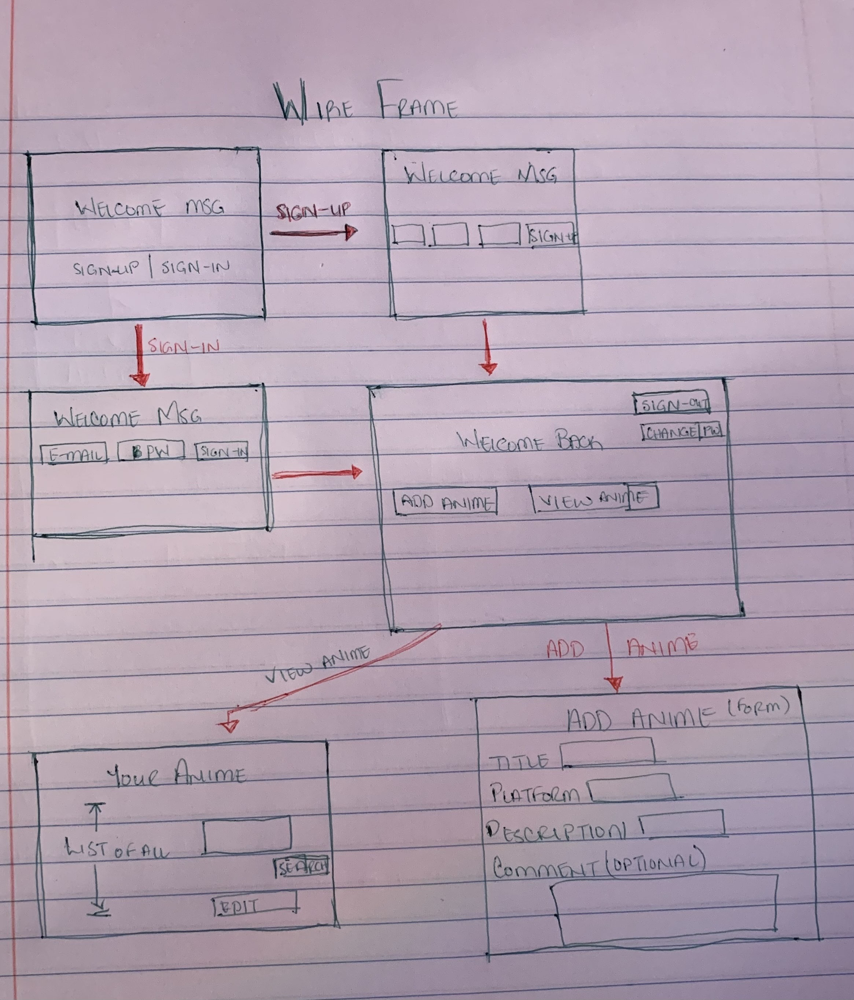

# Anime is for Lovers - API

## Description
This application allows a user to log all of the anime they have watched and/or are currently watching. It currently allows a user to add the anime's title, a brief description, and the current season and episode that the user is on.

Often times I find myself jumping from one anime to another without finishing a season/series. Then, when I return to the show, I forget which episode I last watched.

## Important Links
* [Deployed API](https://still-brook-73978.herokuapp.com/)
* [Deployed Client](https://christielewis.github.io/christielewis-AnimeIsForLovers/)
* [GitHub](https://github.com/christielewis/)

### User Stories

* User will be able to sign up with:
    * user email address, 
    * password, and 
    * password confirmation.
* User can sign in to their account with:
    * user's email address they used upon sign up
    * user's password they used upon sign up
* User can sign out of their account, once signed in.
* User can change their password, once signed in.

* User can Create a new anime with
  * a Title
  * a brief description
  * a number that represents the current season of the created anime
  * a number that represents the current episode of the created anime

* User can Read multiple anime that they have logged
* User can Read a single anime that they have logged using that anime's id.
* User can Update an anime that they own
* User can Delete an anime that they own

### Technologies Used

- Node
- jQuery
- HTML
- Javascript

## Images

#### Wireframe:

---

#### ERD:
